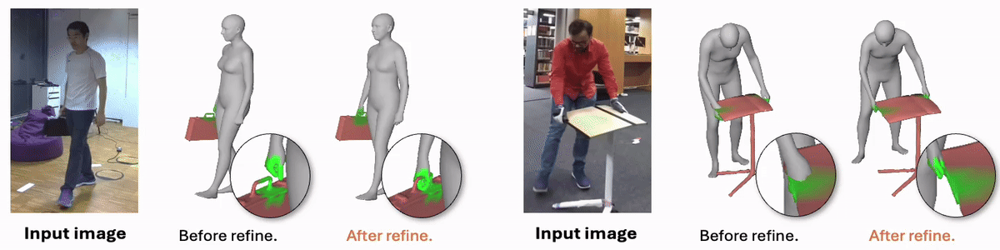
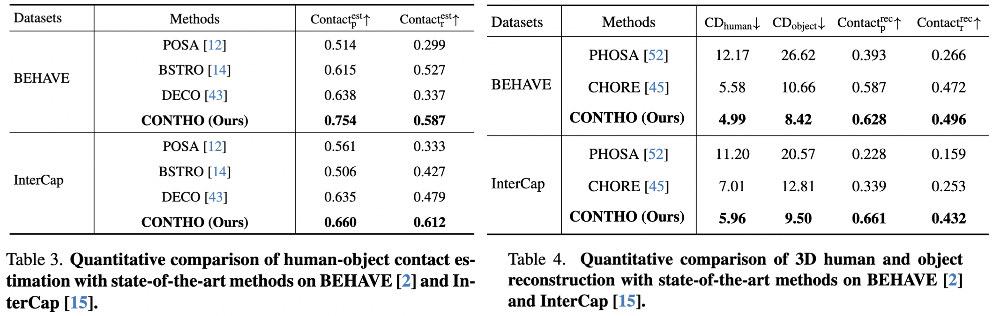
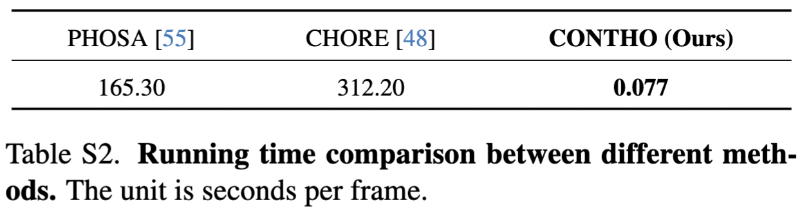

<div align="center">

# <b>CONTHO</b>: Joint Reconstruction of 3D Human and Object via Contact-Based Refinement Transformer

<b>[Hyeongjin Nam*](https://hygenie1228.simple.ink/)<sup>1</sup></b>, <b>[Daniel Sungho Jung*](https://dqj5182.github.io/)<sup>1</sup></b>, <b>[Gyeongsik Moon](https://mks0601.github.io/)<sup>2</sup></b>, <b>[Kyoung Mu Lee](https://cv.snu.ac.kr/index.php/~kmlee/)<sup>1</sup></b> 

<div style="text-align: center;">
    
    &nbsp;&nbsp;&nbsp;&nbsp;
    
</div>

<b><sup>1</sup>Seoul National University</b>, <b><sup>2</sup>Codec Avatars Lab, Meta</b>
</br><span style="font-size:0.86em;">(*Equal contribution)</span>

<a></a>
<a href="https://pytorch.org/get-started/locally/"></a>
[](https://creativecommons.org/licenses/by/4.0/)
<a href='https://contho-release.github.io'></a>
<a href="https://openaccess.thecvf.com/content/CVPR2024/papers/Nam_Joint_Reconstruction_of_3D_Human_and_Object_via_Contact-Based_Refinement_CVPR_2024_paper.pdf"></a>
<a href="https://arxiv.org/abs/2404.04819"></a>

[](https://paperswithcode.com/sota/3d-human-reconstruction-on-behave) [](https://paperswithcode.com/sota/3d-object-reconstruction-on-behave)[](https://paperswithcode.com/sota/contact-detection-on-behave) 


<h2>CVPR 2024</h2>



</div>

_**CONTHO** jointly reconstructs **3D human and object** by exploiting human-object contact as a key signal in accurate reconstruction. To this end, we integrates **"3D human-object reconstruction"** and **"Human-object contact estimation"**, the two different tasks that have been separately studied in two tracks, with one unified framework._
<br/>


## Installation
* We recommend you to use an [Anaconda](https://www.anaconda.com/) virtual environment. Install PyTorch >=1.10.1 and Python >= 3.7.0. Our latest CONTHO model is tested on Python 3.9.13, PyTorch 1.10.1, CUDA 10.2.
* Setup the environment
``` 
    # Initialize conda environment
    conda create -n contho python=3.9
    conda activate contho 

    # Install PyTorch
    conda install pytorch==1.10.1 torchvision==0.11.2 torchaudio==0.10.1 cudatoolkit=10.2 -c pytorch

    # Install all remaining packages
    pip install -r requirements.txt
```


## Quick demo
* Prepare the `base_data` from either [Google Drive](https://drive.google.com/drive/folders/1f0RYWHrCfaegEG24lcuP7-5PfsHGrchj?usp=sharing) or [Onedrive](https://1drv.ms/f/s!ArodDxCaKn6_vgQyOir32GkJOQEE?e=BIZ80m), and place it as `${ROOT}/data/base_data`.
* Download the pre-trained checkpoint from either [Google Drive](https://drive.google.com/file/d/14w3NCl6tMw8nbmMaLdFQnIrqgU9SUWVz/view?usp=sharing) or [OneDrive](https://1drv.ms/u/s!ArodDxCaKn6_vhpHXjGO55_UhW7Y?e=GB94s5).
* Lastly, please run
```
python main/demo.py --gpu 0 --checkpoint {CKPT_PATH}
```

## Data
You need to follow directory structure of the `data` as below.
```
${ROOT} 
|-- data  
|   |-- base_data
|   |   |-- annotations
|   |   |-- backbone_models
|   |   |-- human_models
|   |   |-- object_models
|   |-- BEHAVE
|   |   |-- dataset.py
|   |   |-- sequences
|   |   |   |-- Date01_Sub01_backpack_back
|   |   |   |-- Date01_Sub01_backpack_hand
|   |   |   |-- ...
|   |   |   |-- Date07_Sub08_yogamat
|   |-- InterCap
|   |   |-- dataset.py
|   |   |-- sequences
|   |   |   |-- 01
|   |   |   |-- 02
|   |   |   |-- ...
|   |   |   |-- 10
```
* Download Data01~Data07 sequences from [BEHAVE](https://virtualhumans.mpi-inf.mpg.de/behave/) dataset to `${ROOT}/data/BEHAVE/sequences`. <br/>
(Option 1) Directly download [BEHAVE](https://virtualhumans.mpi-inf.mpg.de/behave/) dataset from their [download page](https://virtualhumans.mpi-inf.mpg.de/behave/license.html). <br/>
(Option 2) Run the script below.
```
scripts/download_behave.sh
```
* Download RGBD_Images.zip and Res.zip from [InterCap](https://intercap.is.tue.mpg.de/) dataset to `${ROOT}/data/InterCap/sequences`. <br/>
(Option 1) Directly download [InterCap](https://intercap.is.tue.mpg.de/) dataset from their [download page](https://intercap.is.tue.mpg.de/download.php). <br/>
(Option 2) Run the script below.
```
scripts/download_intercap.sh
```
* Download base_data from either [Google Drive](https://drive.google.com/drive/folders/1f0RYWHrCfaegEG24lcuP7-5PfsHGrchj?usp=sharing) or [Onedrive](https://1drv.ms/f/s!ArodDxCaKn6_vgQyOir32GkJOQEE?e=BIZ80m).
* (Optional) Download the released checkpoints for BEHAVE ([Google Drive](https://drive.google.com/file/d/1-XWMN-5kAj7pBM6N246pf2HMd_aH6FlT/view?usp=sharing) | [OneDrive](https://1drv.ms/u/s!ArodDxCaKn6_vhuNfTN0o_TlFK44?e=LQduzT)) and InterCap ([Google Drive](https://drive.google.com/file/d/156g5lOdevhDAp4tceTS1GW7_X7ID5a-Y/view?usp=sharing) | [OneDrive](https://1drv.ms/u/s!ArodDxCaKn6_vhkqZm2f9d9P3XpH?e=vMv2lf)) dataset.


## Running CONTHO

### Train 
To train CONTHO on [BEHAVE](https://virtualhumans.mpi-inf.mpg.de/behave/) or [InterCap](https://intercap.is.tue.mpg.de/) dataset, please run
```
python main/train.py --gpu 0 --dataset {DATASET}
``` 

### Test
To evaluate CONTHO on [BEHAVE](https://virtualhumans.mpi-inf.mpg.de/behave/) or [InterCap](https://intercap.is.tue.mpg.de/) dataset, please run
```
python main/test.py --gpu 0 --dataset {DATASET} --checkpoint {CKPT_PATH}
```

### Results
Here, we report the performance of CONTHO. <br/>
CONTHO is a **fast** and **accurate** 3D human and object reconstruction framework!
<p align="center">  
  
</p>
<p align="center">  
  
</p>


## Technical Q&A
* RuntimeError: Subtraction, the `-` operator, with a bool tensor is not supported. If you are trying to invert a mask, use the `~` or `logical_not()` operator instead: Please check [reference](https://stackoverflow.com/questions/65637222/runtimeerror-subtraction-the-operator-with-a-bool-tensor-is-not-supported).
* bash: scripts/download_behave.sh: Permission denied: Please check [reference](https://askubuntu.com/questions/409025/permission-denied-when-running-sh-scripts).


## Acknowledgement
We thank:
* [Hand4Whole](https://github.com/mks0601/Hand4Whole_RELEASE) for 3D human mesh reconsturction.
* [CHORE](https://github.com/xiexh20/CHORE) for training and testing on BEHAVE.
* [InterCap](https://github.com/YinghaoHuang91/InterCap/tree/master) for download script of the dataset.
* [DECO](https://github.com/sha2nkt/deco) for in-the-wild experiment setup.


## Reference
```  
@inproceedings{nam2024contho,    
title = {Joint Reconstruction of 3D Human and Object via Contact-Based Refinement Transformer},
author = {Nam, Hyeongjin and Jung, Daniel Sungho and Moon, Gyeongsik and Lee, Kyoung Mu},
booktitle = {Proceedings of the IEEE/CVF Conference on Computer Vision and Pattern Recognition},  
year = {2024}  
}  
```