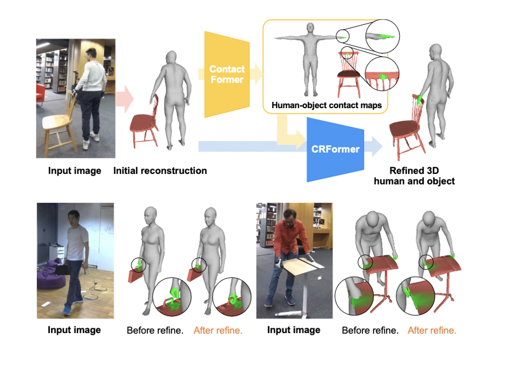

# **Joint Reconstruction of 3D Human and Object via Contact-Based Refinement Transformer (CONTHO)**

> [**Joint Reconstruction of 3D Human and Object via Contact-Based Refinement Transformer**](https://cv.snu.ac.kr/),            
> Hyeongjin Nam*,
> Daniel Sungho Jung*,
> Gyeongsik Moon,
> Kyoung Mu Lee,        
> *Conference on Computer Vision and Pattern Recognition (CVPR), 2024*

  
  

 

  
  

 

## Code release
We are currently preparing for CVPR camera-ready and code re-organization!\
Please take some time for the code to be released.
